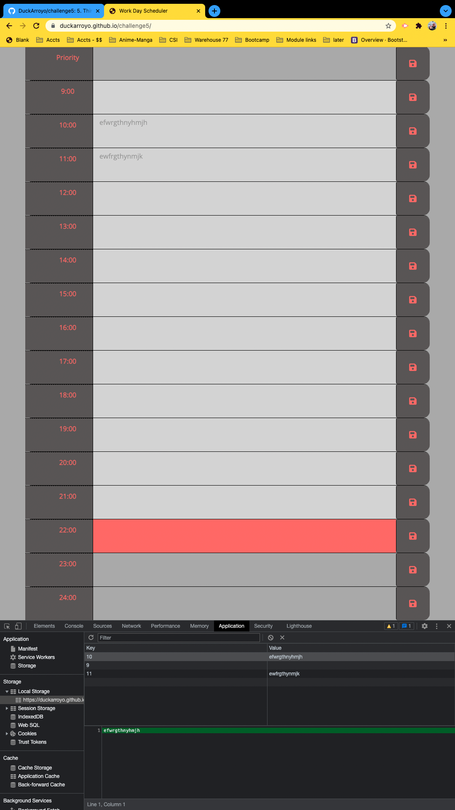
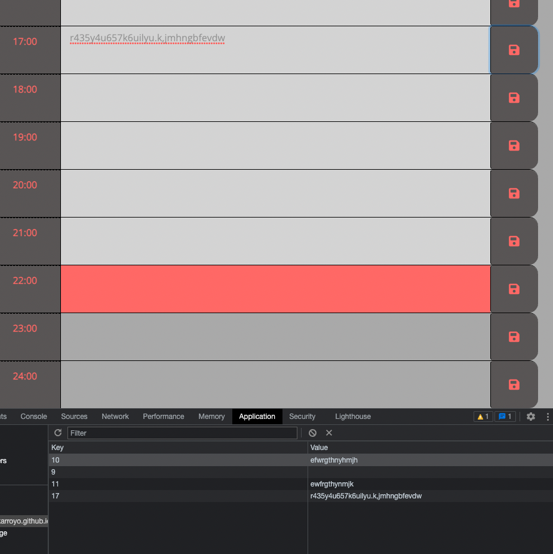

# challenge5

5. Third-Party APIs Challenge: Work Day Scheduler

# Links

Application link
https://duckarroyo.github.io/challenge5/

Repo link
https://github.com/DuckArroyo/challenge5

## Work Notes

Added moment date and hour.

- displays current date and hour.
  Coded blocks of time.
- simplified IDs to avoid converting to local storage and back.
  Storage is persistent
- items persist on page refresh
- items delete by emptying the box and "saving"
  Color coding
- past, present, future conditions color code the boxes

## Screenshots

