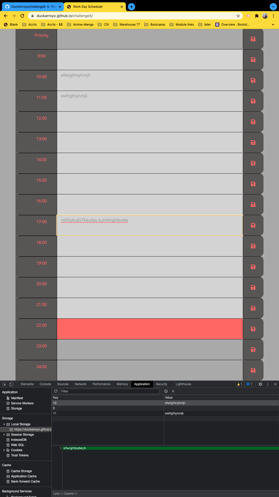

# Day Planner

## UO Coding bootcamp Challenge

## Description

5. Third-Party APIs Challenge: Work Day Scheduler

# Links

[Github Pages](https://duckarroyo.github.io/dayPlanner)

[Github Repository](https://github.com/DuckArroyo/dayPlanner)

## Work Notes

Added moment date and hour.

- displays current date and hour.
  Coded blocks of time.
- simplified IDs to avoid converting to local storage and back.
  Storage is persistent
- items persist on page refresh
- items delete by emptying the box and "saving"
  Color coding
- past, present, future conditions color code the boxes

# Contributions by:

DeveloperDuckArroyo

[Email](mailto:DeveloperDuckArroyo@gmail.com)

[Portfolio](https://github.com/DuckArroyo/portfolio)

[React Portfolio](http://DuckArroyo.github.io/reactPortfolio)

[GitHub](https://github.com/DuckArroyo)

[Twitter @DevDuckArroyo](https://twitter.com/DevDuckArroyo)

[LinkeIn](https://www.linkedin.com/in/duckarroyo)

[CodePen](https://codepen.io/DeveloperDuckArroyo)

## Screenshots

